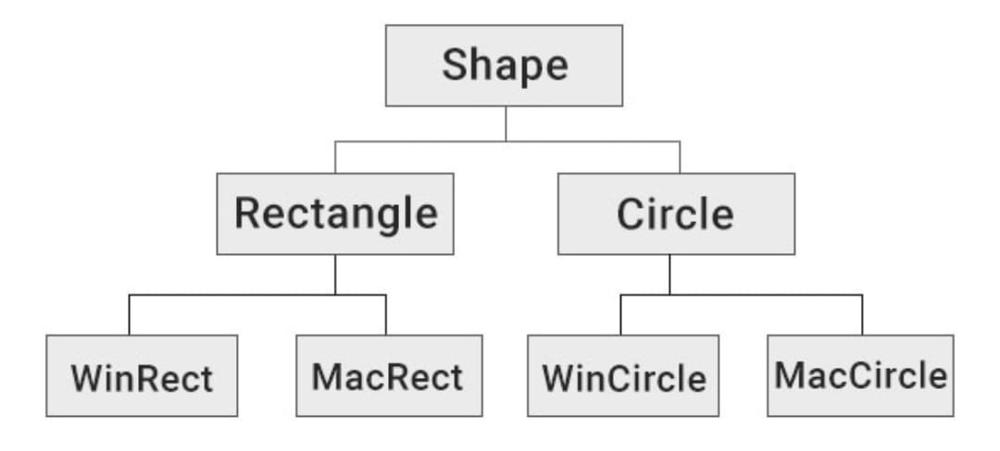
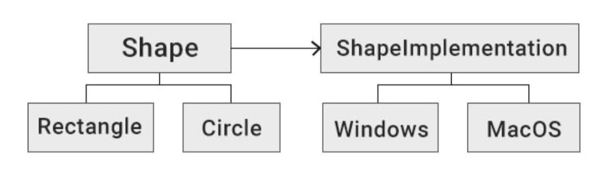

# Bridge

Connecting components together through abstractions.
A mechanism that decouples an interface (hierarchy) from an implementation (hierarchy).

## Motivation

- Bridge prevents a 'Cartesian product' complexity explosion.
- Example:

  - Base class ThreadScheduler
  - Can be preemptive or cooperative.
  - Can run on Windows or Unix.
  - End up with 2x2 scenario: WindowsPTS, UnixPTS, WindowsCTS, UnixCTS

- Bridge pattern avoids the entity explosion.

## Summary

- Decouples abstraction from implementation.
- Both can exist as hierarchies.
- A stronger form of encapsulation.

## Details

The Bridge pattern is designed to separate the abstraction from the implementations so they can be used and changed independently.

Let's look at an example to understand when this is useful and what this "confusing" definition means.
Say you need to create a shape drawing application that should work on both Windows and MacOS.

You could create a Shape interface, inherit from it the types of the shapes, like Rectangle or Circle, and then inherit from those to create the OS-specific implementations.
The class hierarchy would look like this:

Now, consider that you need to support more shape types and more OSes. That would lead to a significant number of classes being added - the number of types multiplied by the number of OS versions.

So, basically, to support five shape types on three different OSes, you would need to write 5\*3=15 implementations.

However, the Bridge pattern suggests refactoring this into two separate hierarchies - one for platform-independent abstractions (Shapes), and the other for platform-dependent implementations (OSes).
Here is the refactored diagram:

The relationship between Shape and ShapeImplementation is the Bridge.

This pattern is used in situations where it would be best to isolate the handling of the system-dependent stuff from the handling of the system-independent stuff.

The Bridge pattern is often confused with the Adapter pattern.
Adapter makes things work after they're designed;  
Bridge is designed up-front to let the abstraction and the implementation vary independently. Further, Adapter is retrofitted to make unrelated classes work together.
In other words, an adapter is a patch. A bridge is put in place on purpose.
